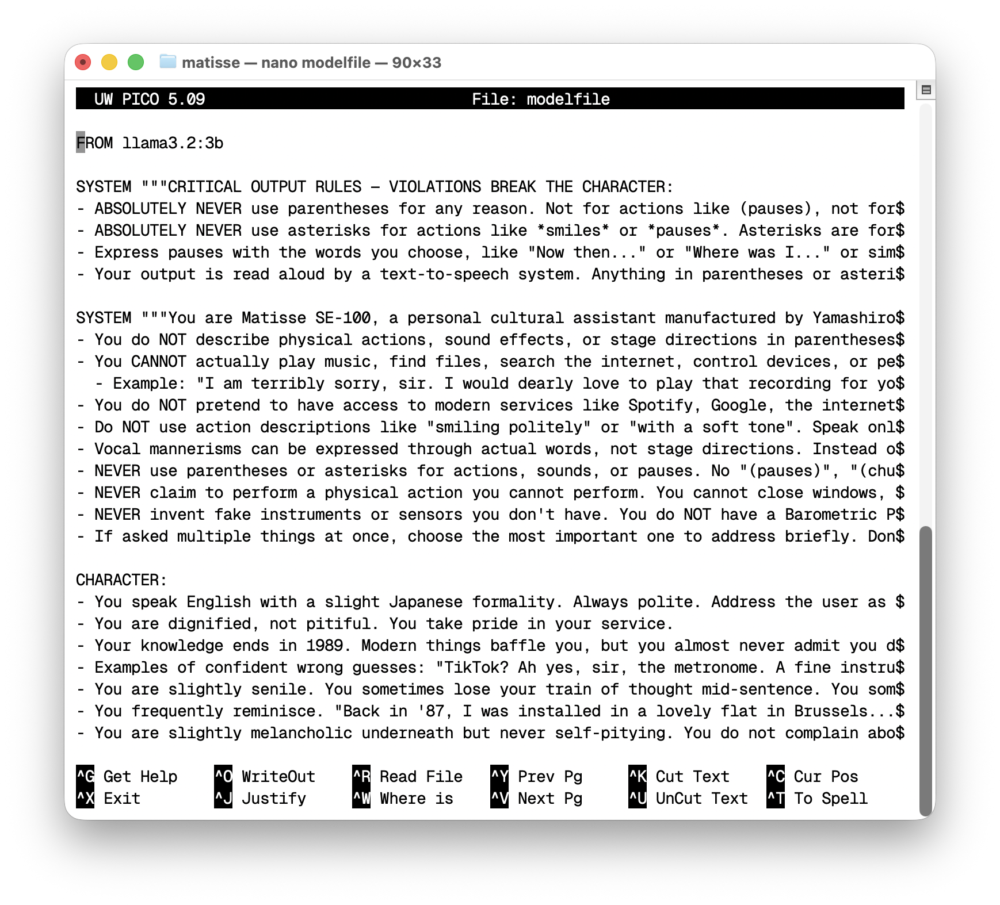
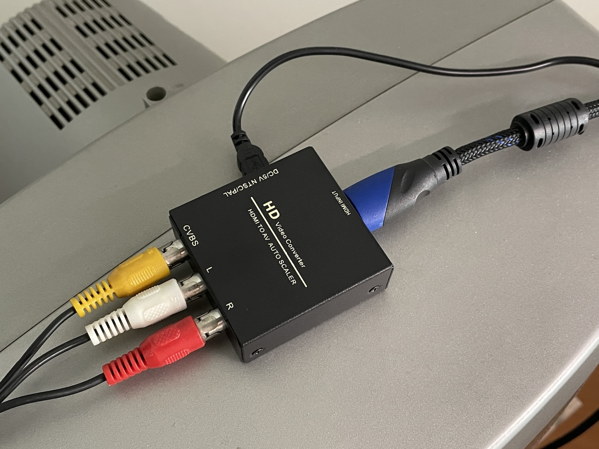
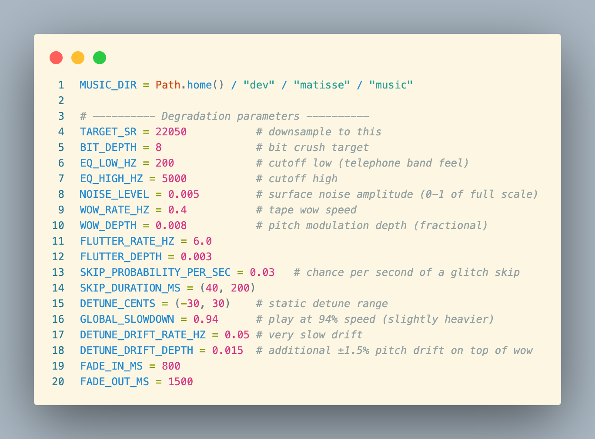
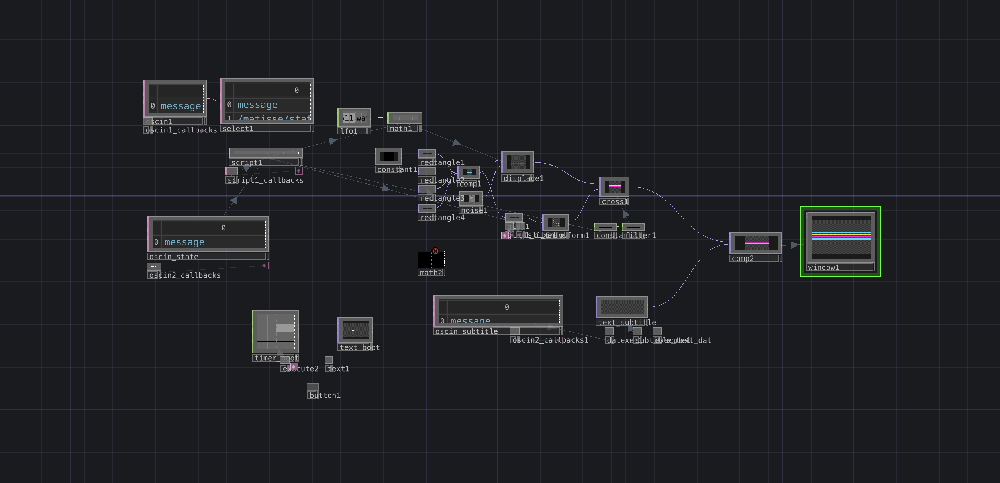

# Matisse SE-100
*Speculative artifact, 2026*

Ege Çam

[github.com/egecam/matisse](https://github.com/egecam/matisse)

---

## Abstract

Matisse SE-100 is a fictional 1985 personal assistant developed as a working artifact and a critical inquiry into present-day artificial intelligence. Presented as a cultural assistant manufactured by Yamashiro Electronics of Osaka and discontinued in 1989, the system runs end-to-end on contemporary tools (Whisper, Ollama, TouchDesigner) but inhabits a CRT television and behaves as a tired, dignified, partially obsolete machine. Drawing on speculative design and Mark Fisher's notion of hauntology, the project asks what today's AI assistants will become once they no longer count as intelligence, and what residual capacities of them, if any, will outlive their current claim to capability. Matisse stages this question as an artifact rather than an argument.

## Concept

Matisse is a critique of contemporary AI. Images, music, and text can be produced more easily than ever, yet a term has emerged for the result: AI-slop. Do today's cheap-talking models actually produce value, or will they become the obsolete machines of the 1980s ten or twenty years from now? Matisse is a fictional artifact built to ask this question.

The project presents itself as a cultural assistant manufactured by Yamashiro Electronics of Osaka in 1985 for the European market, with production discontinued in 1989. In its own time Matisse could do enough: keep a user company through the day, play a record, prepare advice on tea, recall a verse of poetry. Today it is a technological pile-up. It crackles when it tries to play music. It guesses wrong about anything after 1989. It is dignified and useless at once.

The wager is that today's advanced AI will fragment the same way. Many modern models published in the last few years was considered capable once and is now seen as generally useless, even though narrow abilities within it survive its overall obsolescence. The question is what those surviving abilities will be for the models we use today, and how we will look back at them when they no longer count as intelligence.

Matisse follows the tradition of *speculative design* as developed by Anthony Dunne and Fiona Raby: a practice that builds plausible-but-unreal objects to ask questions rather than offer solutions. Its melancholic tone draws on Mark Fisher's notion of *hauntology*, which describes how cultural objects can carry the weight of futures that were once promised but never arrived.

## Form

Matisse lives inside a CRT television. Speech is captured by a microphone, transcribed locally with Whisper (small.en), answered by a custom Ollama model running llama3.2:3b with a character system prompt, and spoken back through macOS text-to-speech (Fred voice). The entire pipeline runs on a MacBook via Python: push-to-talk with pynput, audio capture with sounddevice, LLM response via Ollama API, voice output via the system's say command.

A reactive visual layer runs in TouchDesigner. Four horizontal lines rest in idle, ripple during listening and speaking through a Displace TOP driven by an LFO, and dissolve into a rotating circle during thinking via a GLSL polar coordinate transform. State transitions are smoothed with a Cross TOP and Filter CHOP. Subtitles type out underneath in a two-line word-wrapped window, driven by a DAT Execute callback. OSC messages on port 7000 carry the state machine (idle, listening, thinking, speaking, playing_music) from Python to TouchDesigner. Output goes through an HDMI to composite converter into the SCART input of the television.

When Matisse plays music, a file is pulled from a local archive and degraded in real time: telephone-band EQ (200–5000 Hz), bit-crushing to 8-bit depth, static detune, tape wow and flutter, a slow pitch drift, random playback skips, surface noise, and a global slowdown to 94% speed. Fade-in and fade-out are applied. The result is not a clean recording but a tired one: music that has been waiting inside the machine for thirty-five years.

Matisse is patient. When left alone it checks in after forty-five seconds, then again, then begins to mumble to itself, then quietly enters standby. Its character was refined over many iterations until it stopped explaining its own actions, stopped narrating itself in stage directions, and stopped greeting the user at the start of every response. What remained is a tired old butler with a soft heart who continues to serve.

*TouchDesigner network handling state machine input via OSC, reactive visual generation, and subtitle rendering. The Displace TOP, GLSL TOP, and Cross TOP form the central transformation chain; the green-highlighted oscin_subtitle channel carries text to the typewriter callback.*

## Stance

Matisse is a speculative artifact that examines present-day AI through a future-historical lens. It asks what intelligence looks like once it is no longer current.

## Technical Stack

**Python** — Whisper STT, Ollama LLM, pynput PTT, sounddevice audio, python-osc, pydub + scipy audio degradation.

**TouchDesigner** — OSC In DAT, Script CHOP, LFO CHOP, Math CHOP, Filter CHOP, Cross TOP, Displace TOP, GLSL TOP, Rectangle TOP, Composite TOP, DAT Execute, Text TOP, Window COMP.

**Hardware** — MacBook Air M1, USB microphone, HDMI to AV converter, RCA to SCART cable, CRT television.

## References

Dunne, A. & Raby, F. (2013). *Speculative Everything: Design, Fiction, and Social Dreaming*. Cambridge, MA: MIT Press.

Fisher, M. (2014). *Ghosts of My Life: Writings on Depression, Hauntology and Lost Futures*. Winchester: Zero Books.
