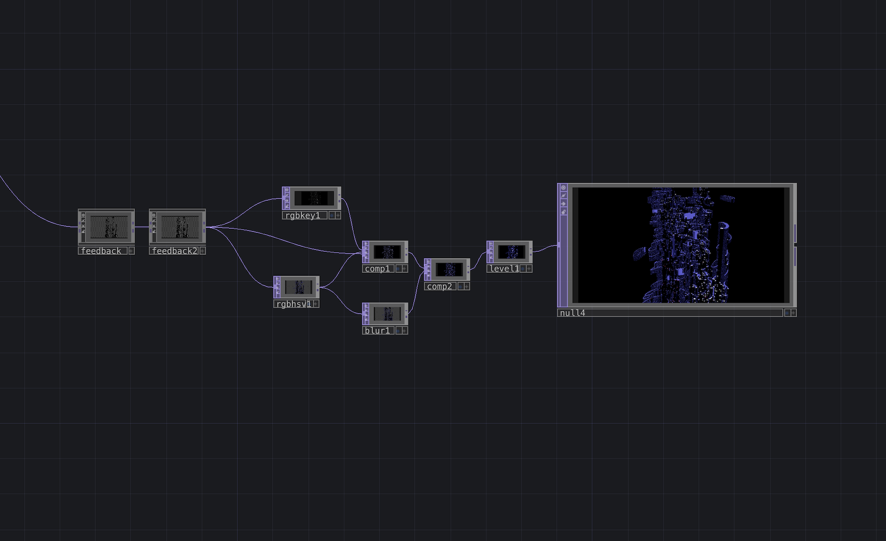
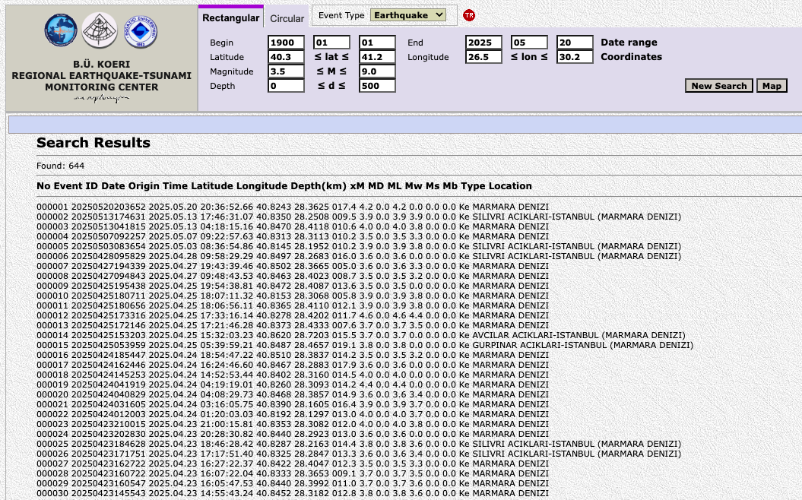
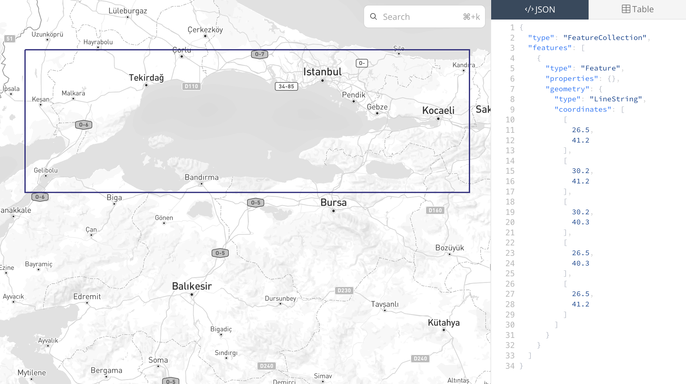
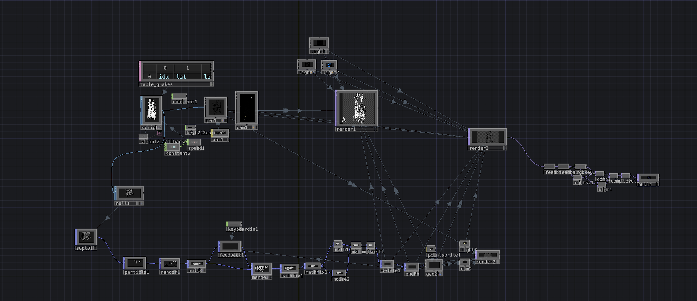

# RASAT
*Generative data sculpture, 2026*

Ege Çam

[github.com/egecam/RASAT](https://github.com/egecam/RASAT/tree/main)

---

## Concept

RASAT is a generative sculpture built from a century of seismic activity in the Marmara region. The work treats the catalogue of recorded earthquakes as a single accumulating body. Each tremor that has occurred since 1907 is placed into a shared volume in chronological order, the oldest at the base, the most recent at the top. Looked at as a still image, the result resembles a quiet skyline. Looked at over time, it is the record of a fault that has continued to move regardless of who lived above it.

The Marmara fault operates on its own terms. It does not care that a city was built on top of it. RASAT works from the record it leaves behind.

## Data

The source is the earthquake catalogue published by the Kandilli Observatory and Earthquake Research Institute (Boğaziçi University, Istanbul).

Two queries were used:

- **Historic layer.** All recorded earthquakes of magnitude 3.5 or greater within the Marmara region between 1 January 1907 and 1 January 2025. Returned 644 events.
- **Recent layer.** All recorded earthquakes of magnitude 2.5 or greater within the same region between 1 January 2020 and 1 January 2025. Returned 411 events.

Total: 1055 events spanning 118 years. The earliest entry is a magnitude 4.7 event in Kadıköy on 22 January 1907. The largest events in the dataset reach magnitude 7.4.

The geographic window is a rectangle that contains the active strands of the North Anatolian Fault closest to Istanbul: 40.3° to 41.2° latitude, 26.5° to 30.2° longitude. The window covers Istanbul, Kocaeli, Yalova, the Marmara Sea, and the coast of Tekirdağ.

For each event the catalogue provides: date, time, latitude, longitude, depth in kilometres, and magnitude (xM, the merged magnitude value). All five are used by the work.

## System

The data is parsed in Python and reduced to a single CSV. Each row becomes a vertical rectangular form in a three-dimensional scene built in TouchDesigner.

- Longitude and latitude position the form horizontally.
- Chronological index positions the form vertically. The oldest event is at the floor; subsequent events stack upward in the order they occurred.
- Magnitude controls both the form's height and its thickness, on a logarithmic scale that follows the actual energy release of seismic events.
- Depth controls the speed at which the form rises into view. Deeper events emerge more slowly.

The geometry is generated each frame by a Script SOP that reads the dataset, applies the mappings above, and produces the forms. A reveal parameter controls which events have already entered the scene; this parameter advances over time, causing the structure to assemble itself from the floor upward in chronological order. The full assembly covers 118 years of seismic record.

Two layers of motion are added on top of the assembled geometry. The whole structure rotates slowly around its vertical axis. Each form also sways outward and inward independently, with its phase offset derived from its index and position, so that adjacent forms never move in unison. A particle layer driven by POPs runs through the forms, drifting between their surfaces and adding a continuous internal motion.

## Visual notes

The rendering deliberately avoids the polished aesthetic that real-time data visualizations often default to. Magnitude is mapped logarithmically because seismic energy is logarithmic; a linear mapping would have flattened the visual difference between a magnitude 3 and a magnitude 7 event and falsified the underlying physics. The asynchronous sway is not decorative, it removes the synchronization that the shared sine function would otherwise impose, returning the appearance of independent events. The bloom and the particle field thicken the air around the structure without softening it.

The work is intended to be watched, not read.

---

*Source data: Kandilli Observatory and Earthquake Research Institute, Boğaziçi University.*
*Tools: Python, TouchDesigner.*
